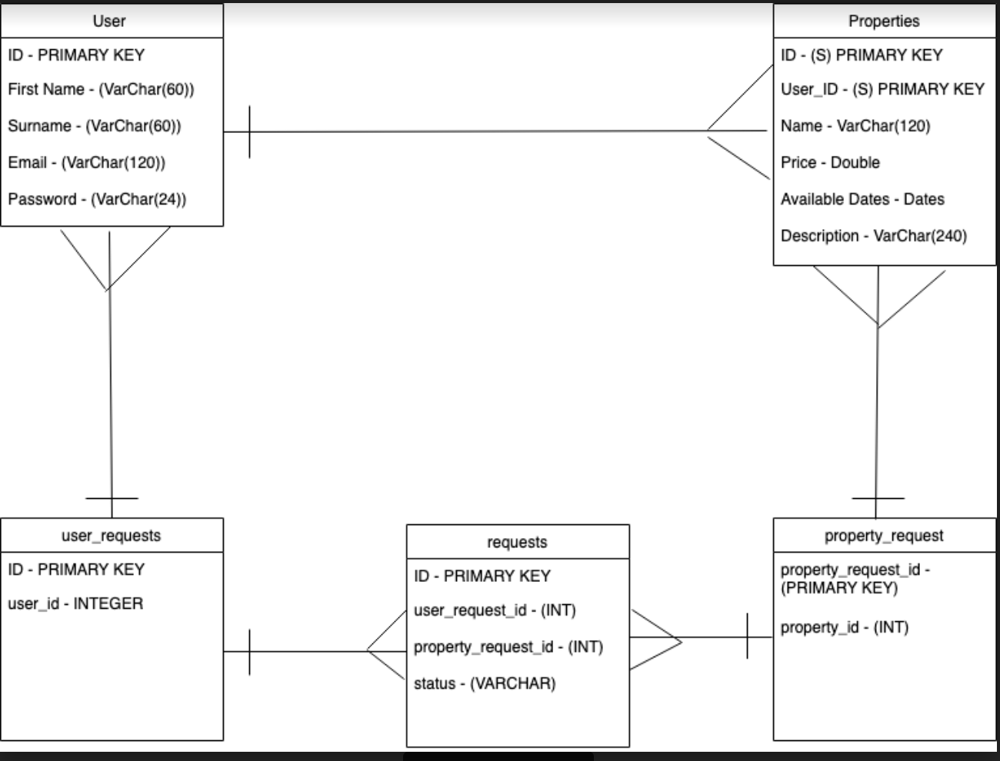
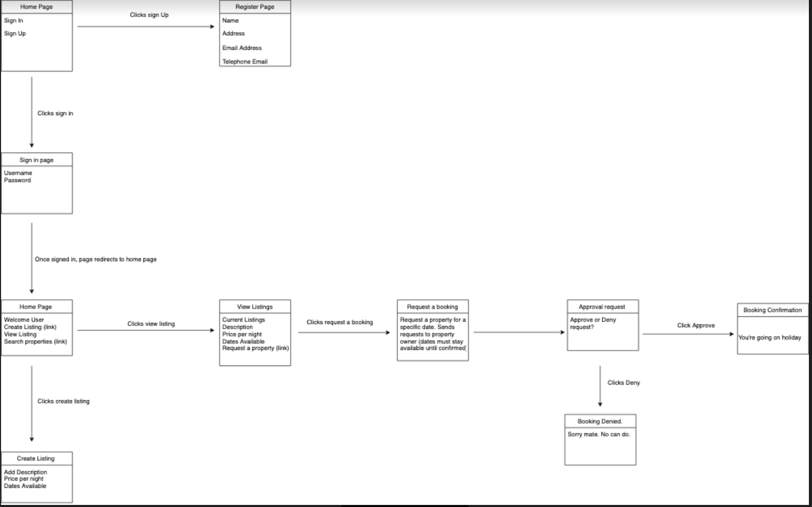

MakersBnB Challenge
=================

__Team Collaborators__

[Marcus Clairmont](https://github.com/Kintaro-Oe) |
[Sejin Kim](https://github.com/sejinkay) |
[Jordan Roberts](https://github.com/jordantroberts) |
[Scott Hall](https://github.com/HottScall)

### Context
Makers Academy - Week six group challenge:
Build an Airbnb clone.

### Build Status  
* MVP achieved - *YES*
* 7 of 9 User Stories completed. Outstanding stories are:      
    - Approve the booking
    - Appears open until confirmed


### Document Organisation
* Models: ./lib/
* Views: ./views/
* Controller : app.rb
* Tests: ./spec/
* Database: ./migrations
* Images: ./public/images

### Technologies Used
__Development Environment__

* Languages: Ruby, SQL
* Framework: Sinatra  

__Test Environment__

* Feature testing: Rspec, Capybara
* Unit testing:  Rspec
* Analytics: simplecov

__Database__

* RDBMS: PostgreSQL
* Integration & setup: PG gem, psql

### User stories - Features
```
As a User
So that I can login to Makers B&B
I would like to create an account by registering my details

As a Property Owner
So that I can rent out my property
I would like to list it on Makers B&B

As a Property Owner
So that I can rent out more than one place
I would like to be able to list multiple properties on Makers B&B

As a Property Owner
So that I can attract users to my property
I would like to be able to add a description and price per night to my property listing

As a Property Owner
So that I can ensure the dates are convenient for me
I would like to clarify the dates that my place will be available

As a User
So that I book a property to stay in
I would like to request a property booking for one night

As a Property Owner
So that I can make sure my property will be in safe hands
I would like to be able to approve the booking request

As a User
So that I can book an available property
I would like to be able to see the available dates

As a Property Owner
So that I don't miss out on bookings
I would like the listing to be appear available until I confirm the booking request
```

### Domain Models

A model of our relevant databases including the columns, data types and relationships between the databases.



A basic model our entire site including the pages, the content on the pages and what happens upon each click on the page.




### How to install
__Pre install__

You will need to set up local databases in order to run and test this app properly. Please ensure that postgresl is installed before you continue. These steps require terminal, please open one.

* Install `psql` by entering `brew install postgresql`

* From the terminal run `createdb <user>` swap '<user>' for the username on your machine.

__Base install__

Now you are ready to clone the repo!

 * Open your terminal and clone the project by entering `git clone <repo url>`

 * Navigate into the new directory using `cd MakersBnB`

 * Once inside type `bundle install`. This will install all the gems needed to launch and test the app.

 * The last step is to enter the following line:
 `psql -f ./db/migrations/01_create_tables.sql`
 This will run the SQL script in `db/migrations` folder and setup the appropriate tables needed.

## How to Run
__Launching & closing the server for the app__

* Enter `rackup -p 3456` into command line to start the server. (3456 may be changed to any port number you like)
* Enter `CTRL+C` to close the server

__Viewing the app__

* Enter url `http://localhost:3456/` (or your chosen port number) into your browser to view and interact with the app 


__Testing__

* Open your terminal, navigate to the MakersBnB directory and run `rspec`
